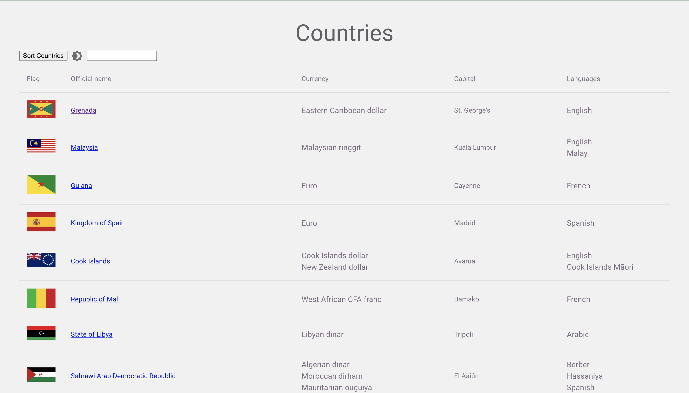
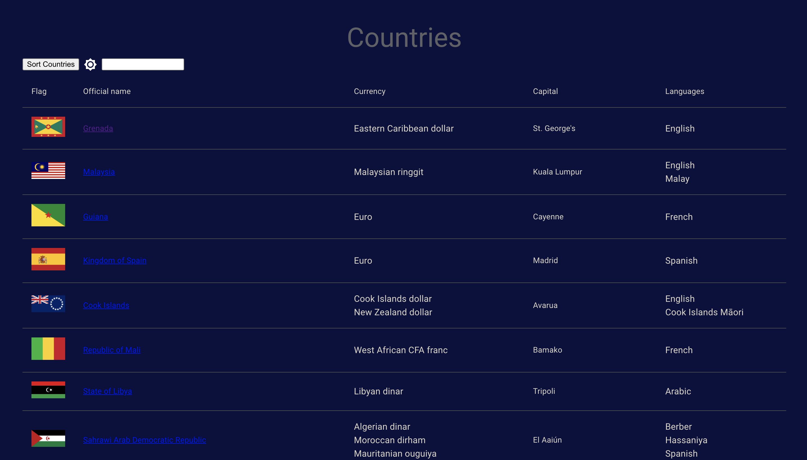
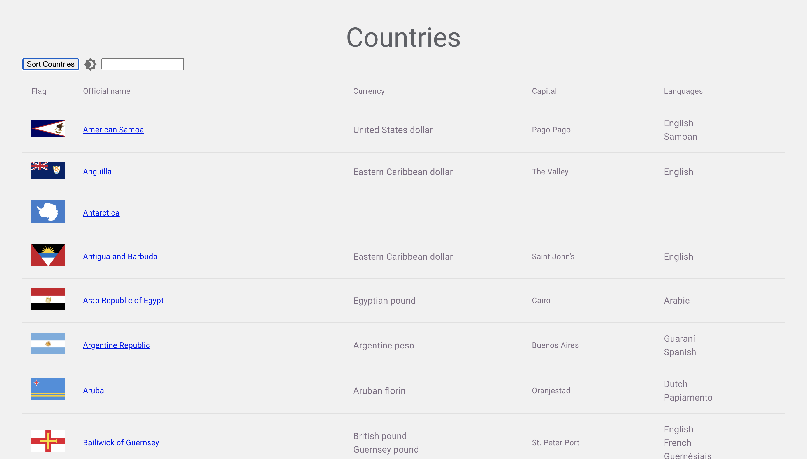
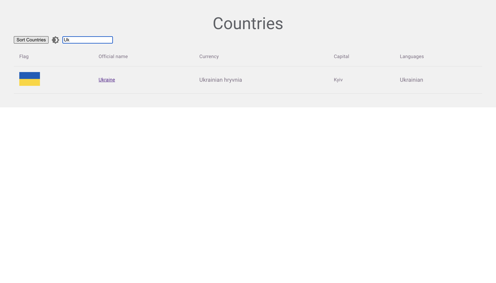
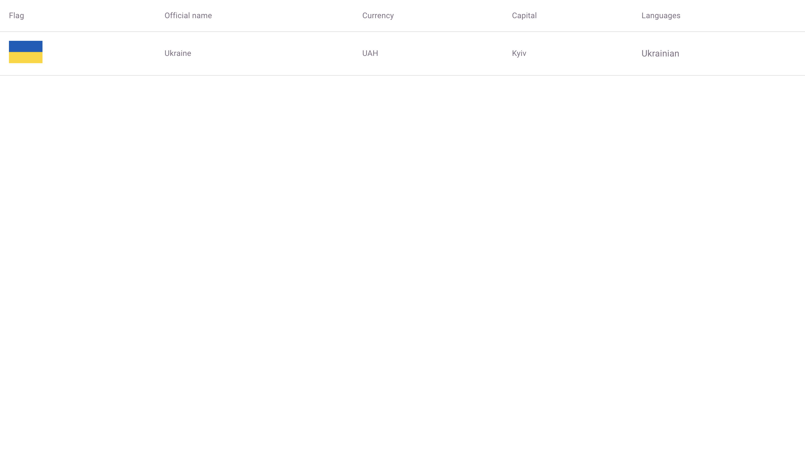

# Frontend React Project

This is my final project for the frontend module 

## About this project:
### Step 1

- Fetch all the countries and return the data from [countries APIs](https://restcountries.com/). Display the data on the screen
- Given a country name as argument, returns the data about that country from [countries APIs](https://restcountries.com/).

### Step 2

- Render the data of all the countries (from Step 1) in a table using smaller components: `TableHead`, `TableBody`, `TableRow`

### Step 3

- Integrate react router and create 2 pages: `home`, and `country`
- Homepage contains the countries table that i created above
- Country page render the data about one specific country only
- When a user click on the name of the country in the table, they will be routed to the `country` page

### Step 4

- Set up all the redux boilerblate for the project
- Everything related to redux stays in one folder: reducers, store

### Features

- Implement a search bar to search for a country
- Sort the table based on name, region, etc.
- dark/light theme

## Preview:

